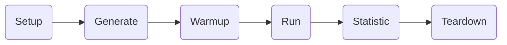

# Rspack Benchmark

This repository is used to monitor Rspack performance.

## Usage

You can use the scripts in the `bin` directory to prepare and run benchmark. All interactions are of the form

```
node bin/cli.js [command] [args]
```

If no command is specified, then `build`, `bench` and `compare` commands will all be ran by default.

### Commands

#### build

```
node bin/cli.js build [--ref <ref>]
```

Clone and build [Rspack](https://github.com/web-infra-dev/rspack) in the folder which defined by the environment variable of `RSPACK_DIR` or `<project_root>/.rspack`. You can set Git ref with the parameter, e.g.:

```bash
node bin/cli.js build # use the main branch to build
node bin/cli.js build --ref main # use the main branch to build
node bin/cli.js build --ref pull/1000/head # use the pull request with index 1000 to build
```

#### bench

```
node bin/cli.js bench [--job <benchmark-names> ...]
```

Run benchmark with Rspack and write the output to `output` folder. You can configure the environment variable of `RSPACK_DIR` to set the Rspack project path, and it will use the Rspack from the `.rspack` folder by default. eg.

```bash
node bin/cli.js bench # run all benchmarks
node bin/cli.js bench --job 10000_development-mode --job 10000_production-mode # run benchmarks named 10000_development-mode and 10000_production-mode
RSPACK_DIR=<your-rspack-path> node bin/cli.js bench --job 10000_development-mode_hmr # set the rspack command path, and run 10000_development-mode_hmr
```

#### compare

```
node bin/cli.js compare [--base <baseDate>] [--current <currentDate>]
```

Compare and print the difference between `<baseDate>` and `<currentDate>`. The parameter has three types, `"current"` will use the data from `output` folder. `"latest"` will use the latest data from `data` branch. A date string like `YYYY-MM-DD` will use the data of that day from `data` branch. eg.

```bash
node bin/cli.js compare --base current --current latest # use output data as base, and latest data as current
node bin/cli.js compare --base latest --current 2023-08-17 # use latest data as base, and the data of 2023-08-17 as current
```

## Glossary

#### Benchmark Name

Benchmark name is a string containing the case name and the addon names. A benchmark name is separated by "\_", the first part is the case name, amd the other parts are the addon names.

#### Case

The benchmark case is the Rspack project in `cases` folder. It must contain `rspack.config.js` and `hmr.js`, the first one is the default config for Rspack, the next one is used to tell benchmark how to change file when hmr.

- `10000` is a project with 10000 modules
- `threejs` is a copy of three js
- `bundled-threejs` imports the `three` package directly to benchmark large bundled-library builds

#### Addon

The addon is used to change Rspack configuration and benchmark parameters. All addons are registered in `lib/addons`.

- `development-mode` is used to set the development mode
- `production-mode` is used to set the production mode
- `10x` is used to make the project module 10 times larger
- `hmr` is used to change the phase of collected metrics to hmr instead of build

#### Metric

The metrics collected through benchmarking includes `stats`, `exec`, `dist size`, etc.

#### Tag

The tag is `benchmarkName` + `metric`, it is used to display information on website and comparison results.

## How benchmark works

Rspack benchmark consists of the following steps.



- `Setup` is used to prepare the benchmark case environment and global context.
- `Generate` will generate the benchmark case.
- `Warmup` will attempt to run the benchmark case.
- `Run` will run the benchmark case multiple times and collect metric data.
- `Statistic` will calculate the final result through multiple benchmarks.
- `Teardown` is used to clean up.

The main process is controlled by `scenario`, and its structure is:

```typescript
interface Context {
    caseDir: string
    originalFiles: Record<string, string>
    // final rspack.config.js string
    config: string
    // hmr config
    hmrConfig: Array<{
        rebuildChangeFile: string
        generateContent(originalContent, runTimes): string
    }>
    rspackArgs: string[]
    // how many times should run
    runTimes: number
    // timeout milliseconds
    timeout: number
    runData: Array<{
        stats: number
        exec: number
        ...
    }>
    result: Record<"stats" | "heap memory" | "rss memory"
     | "external memory" | "array buffers memory" | "exec"
     | "dist size", {
        min: number,
        max: number,
        mean: number,
        median: number,
        variance: number,
        stdDev: number,
        confidence: number,
        low: number,
        high: number,
        count: number,
        base: number
     }>
}

interface Scenario {
    async setup(): Context
    async generate(ctx: Context): void
    async warmup(ctx: Context): void
    async run(ctx: Context): void
    async statistic(ctx: Context): void
    async teardown(ctx: Context): void
}
```

The addons can change context in most steps, and its structure is:

```typescript
interface Addon {
	beforeSetup(): void;
	afterSetup(ctx: Context): void;

	beforeGenerate(ctx: Context): void;
	afterGenerate(ctx: Context): void;

	beforeStatistic(ctx: Context): void;
	afterStatistic(ctx: Context): void;

	beforeTeardown(ctx: Context): void;
	afterTeardown(ctx: Context): void;
}
```

## How to add a benchmark case

1. move your project into the `cases` folder
2. move the project dependencies to global package.json
3. add `rspack.config.js` to make the project runnable by Rspack
4. add `hmr.js` to make the project support hmr changes
5. try run `RSPACK_DIR=<your-rspack-path> node bin/cli.js bench <your case>_<your addons>` to test

## How to create a addon

1. create your addons in `lib/addons` with kebab case like "a-b-c.js"
2. export default a class that extends `lib/addons/common` and implement the hooks you want to listen
3. try run `RSPACK_DIR=<your-rspack-path> node bin/cli.js bench <case>_<your addons>` to test
4. if you want to run some benchmark name by default, you can add it to `jobs` field in `./bench.config.js`.

## License

MIT licensed.
